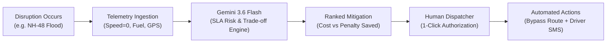

# FleetPulse AI — Executive Project Brief & System Overview

**Project Title:** FleetPulse AI — Autonomous Logistics Control Tower  
**Live Production URL:** [https://fleet-pulse-ai.vercel.app/](https://fleet-pulse-ai.vercel.app/)  
**Source Repository:** [https://github.com/VenkiV8/FleetPulse-AI](https://github.com/VenkiV8/FleetPulse-AI)  
**Target Domain:** Intelligent Transportation Systems (ITS) & Autonomous Freight Decision Support  

---

## 1. Executive Summary & Problem Statement

Modern commercial freight operations in high-density logistics corridors (e.g., Golden Quadrilateral, port hinterlands) operate under strict **Service Level Agreements (SLAs)** with severe financial penalties for delivery delays (Just-In-Time manufacturing shutdowns, perishable cold-chain spoilage, port customs cut-off breaches).

When unexpected physical disruptions occur—such as flash flooding, mechanical breakdowns, or port gate congestion—traditional dispatch centers rely on slow, manual phone trees and fragmented spreadsheets. This latency turns manageable delays into compounding multi-lakh financial penalties.

**FleetPulse AI** solves this by combining **interactive geospatial telematics (Leaflet)** with a **generative AI reasoning engine (Google Gemini 3.6 Flash)** to autonomously assess SLA breach risks in real time, calculate cost-benefit trade-offs in Indian Rupees (INR), formulate ranked mitigation bypass routes, and empower human dispatchers with one-click governance.



---

## 2. Key Features & Capabilities

### 🎛️ 1. Mission-Critical 3-Column Cockpit Layout
* **Active Consignments Queue (Left Panel):** Real-time monitoring of all active freight consignments with dynamic severity badges (`CRITICAL`, `MONITORING`, `ON TRACK`, `MITIGATED`), client identifiers, route milestones, and live delay tracking.
* **Geospatial & Telemetry Center (Middle Panel):** Interactive Leaflet map with custom SVG vehicle markers, origin/destination nodes, live route polylines, and real-time vehicle gauges (speedometer, fuel level, odometer, remaining distance).
* **AI Copilot & Decision Matrix (Right Panel):** Gemini intelligence engine showing breach probability, financial exposure, ranked strategy cards, and communication drawers.

---

### 🗺️ 2. Real-Time Corridor Disruption Simulation
FleetPulse AI features a built-in Disruption Engine demonstrating 3 high-stakes Indian supply chain scenarios:

| Scenario | Client & Cargo | Corridor / Bottleneck | Disruption Type | SLA Risk & Impact |
| :--- | :--- | :--- | :--- | :--- |
| **1. NH-48 Flash Flooding** | Tata Motors · Auto Sub-Assemblies (18T) | Mumbai ➔ Pune (Km 58–71) | IMD Red Alert Flood (40cm water) | ₹1.68 Cr plant downtime risk; JIT assembly line stoppage |
| **2. NH-44 Breakdown** | Reliance Retail · FMCG Cold-Chain (14T) | Delhi ➔ Nagpur (Km 312) | Coolant Failure / Engine Seizure | ₹9.5L penalty; perishable temperature breach in <3h |
| **3. JNPT Port Gridlock** | Foxconn Export · iPhone PCBs (4T) | Chennai ➔ JNPT Port Gate 5 | 8-Hour Port Gate Gridlock | ₹4.8 Cr export revenue; missing container vessel cut-off |

---

### 🧠 3. Gemini 3.6 Flash Decision Engine
* **Server-Side Architecture (`/api/copilot`):** Next.js App Router endpoint calling Google's `gemini-3.6-flash` model with strict JSON Schema enforcement.
* **Radial SLA Breach Risk Gauge:** 270° SVG arc meter color-coded by severity, calculating breach probability and financial exposure in INR.
* **Trade-Off Strategy Matrix:** Automatically formulates and ranks two mitigation options comparing:
  - **Operational Cost (₹)** vs. **Delay Impact (mins)** vs. **Net Penalty Saved (₹)**
  - Dynamic 3-step actionable implementation protocol per strategy.
* **Automated Monospace Communications:**
  - **Driver Dispatch Memo:** Formal operational instructions with GPS coordinates and reference codes, equipped with 1-click clipboard copying.
  - **Customer Advisory SMS:** 160-character character-limited SMS preview ready for instant dispatch to clients.
* **Zero-Failure Fallback System:** If API rate limits or network issues occur, the system seamlessly transitions to pre-calculated realistic models without interrupting the user experience.

---

### 🛡️ 4. Human-in-the-Loop (HITL) Governance & One-Click Execution
* **"Approve Dispatch Override" Button:** Allows human dispatchers to authorize recommended actions with a single click.
* **Instant Confirmation Toast:** Floating notification showing authorization token (e.g. `FP-GOV-XXXX`), timestamp, and route update.
* **Dynamic KPI Accumulator:** Automatically updates the top KPI bar's **Avoided Penalties** metric (e.g. $+₹4.2\text{L}$ saved).
* **Live Map Rerouting:** Immediately transforms the map display from a blocked corridor to an illuminated green bypass route avoiding the hazard zone.
* **Status Synchronization:** Updates shipment badge from red **`CRITICAL`** to emerald green **`MITIGATED`**.

---

## 3. System Architecture & Tech Stack

```
┌────────────────────────────────────────────────────────┐
│                   Next.js 16 Client                     │
│  (Tailwind CSS 4 · Lucide React · React-Leaflet Map)   │
└──────────────────────────┬─────────────────────────────┘
                           │ POST /api/copilot (JSON)
┌──────────────────────────▼─────────────────────────────┐
│               Serverless API Route (/api/copilot)       │
│           (Google GenAI SDK · JSON Schema Validation)   │
└─────────────┬───────────────────────────┬───────────────┘
              │ Success                   │ 429 / Offline
┌─────────────▼─────────────┐   ┌─────────▼──────────────┐
│   Google Gemini 3.6 Flash  │   │  Pre-Calculated Mock   │
│   (Live LLM Reasoning)    │   │  Resilience Fallback   │
└───────────────────────────┘   └────────────────────────┘
```

* **Frontend Framework:** Next.js 16 (App Router) + React 19 + TypeScript
* **Styling & Design System:** Tailwind CSS 4 + Dark Glassmorphic Cockpit UI
* **Geospatial Mapping:** Leaflet 1.9 + React-Leaflet with custom CSS animations
* **AI Intelligence:** `@google/genai` (Gemini 3.6 Flash / JSON Schema Mode)
* **Icons:** Lucide React
* **Deployment:** Vercel Global Edge Network

---

## 4. Key Academic & Technical Highlights

1. **Deterministic Structured Outputs:** Utilizes native JSON schema mode to guarantee zero hallucinations in numerical cost/savings calculations.
2. **Resilient System Architecture:** Implements a three-tier fallback architecture ensuring 100% uptime regardless of API quota constraints.
3. **Domain Realism:** Tuned specifically for Indian freight logistics, incorporating NHAI highway benchmarks, IMD weather alerts, and port cut-off constraints.
4. **State Machine Synchronization:** Synchronizes scenario selection, map viewport coordinates, route polylines, vehicle telemetry, and copilot reasoning.
